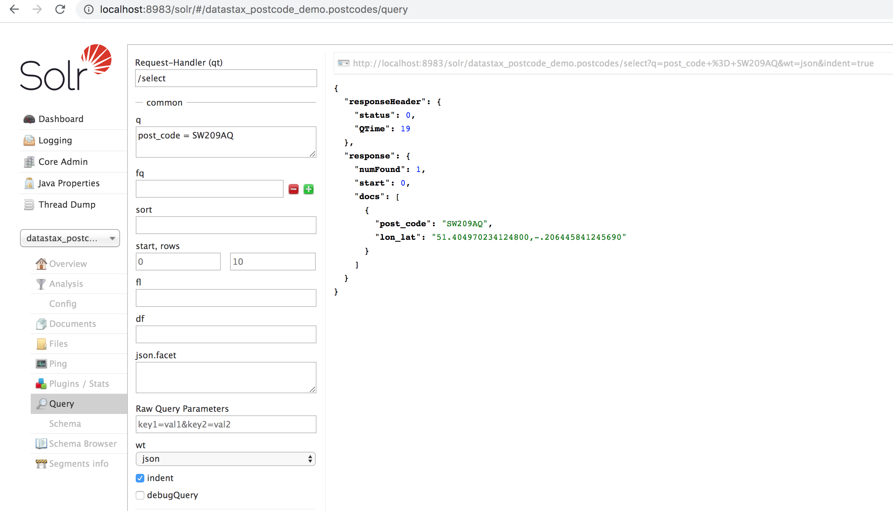

# Geospatial Demo
This is short demo which shows how to find all the UK postcode within a certain area. This area can be a postcode
or a longitude/latitude combination.

Contributor(s): [Patrick Callaghan](https://github.com/PatrickCallaghan)

## Objectives
* To demonstrate how Cassandra and Datastax can be used to solve IoT data management issues.

## Project Layout
* [SchemaSetup.java](/src/main/java/com/datastax/demo/SchemaSetup.java) - Sets up the datastax_postcode_demo schema.
* [postcodes_new.csv](postcodes_new.csv) - File with postcode data.

## How this Works
The postcode data is loaded in Cassandra first, then a Solr core is created that allows various spatial queries to be performed.

## Setup and Running

### Prerequisites

* Java 8
* A DSE cluster
* Maven to compile and run code

### Running

* **Setup the schema**

Note: This will drop the keyspace `datastax_postcode_demo` and create a new one. All existing data will be lost.

To create the a single node cluster with replication factor of 1 for standard localhost setup, run the following

    mvn clean compile exec:java -Dexec.mainClass="com.datastax.demo.SchemaSetup"

To specify contact points use the contactPoints command line parameter e.g. `-DcontactPoints=192.168.25.100,192.168.25.101`
The contact points can take mulitple points in the IP,IP,IP (no spaces).    

* **Load postcode data**  

Now we can load the postcode data from the postcodes_new.csv file in the home directory.

You can use the cqlsh copy to do this.

Open a cql shell and run:  

	copy datastax_postcode_demo.postcodes (post_code, lon_lat) from '{demo_dir}/postcodes_new.csv';

* **Create the Solr core**

To create the solr core, run

  	bin/dsetool create_core datastax_postcode_demo.postcodes reindex=true schema=src/main/resources/solr/postcode_geo.xml solrconfig=src/main/resources/solr/solrconfig.xml

* **Sample queries**

Once these commands have been run, we can start to query the Solr Admin.

First we will using the 'q' field to query for post_code = SW209AQ

To do this in CQL run the following

	select * from postcodes where solr_query = '{"q": "post_code:SW209AQ"}';

Next we do a spatial query to filter out anything that is outside of 1km from lon/lat co-ordinates that we found from looking up SW209AQ. Now we use check the spatial checkbox and fill in the details - also we use the 'fq' field to declare we are geo filtering. The 'q' field is now set back to '*:*'

![Image of Postcode lookup within Distance]
(https://raw.githubusercontent.com/PatrickCallaghan/images/master/PostCodeDist1.png)

To do this in CQL run the following

	select * from postcodes where solr_query = '{"q": "*:*", "fq": "{!geofilt sfield=lon_lat pt=51.404970234124800,-.206445841245690 d=1}"}';

Next we want to add the distance from the query point to the results and also sort them by the nearest postcodes. For this we add the 'geodist() asc' to the sort field and in the field 'fl' we will return 'post_code, lon_lat and geodist()'

![Image of Postcode lookup within Distance sorted]
(https://raw.githubusercontent.com/PatrickCallaghan/images/master/PostCodeDist1Sorted.png)

Finally we are going to change the search area to be a bounded box area which has a radius of 1km. This is sometimes better for maps that are relatively square. For this we change the filtering query from '{!geofilt}' to '{!bbox}'

![Image of Postcode lookup for a bounded box filter]
(https://raw.githubusercontent.com/PatrickCallaghan/images/master/PostCodeBBox.png)

 * **Remove the schema**

 To remove the tables and the schema, run the following.

    mvn clean compile exec:java -Dexec.mainClass="com.datastax.demo.SchemaTeardown"
